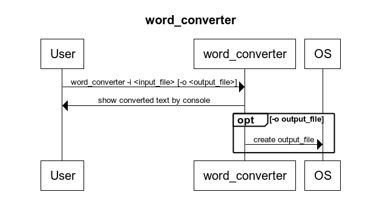

# NumberTranslator  
##What does NumberTranslator do?
This project generates an executable file called *word_convert* which is able to read a file, separate in sentences that file taking the period character as sentence end, and replace every number from one to one billion (one billion included) in words and translate it to a numerical one.
##How to install
Ensure that you have a working and configured CMake and you are connected to the Internet.
Clone this repository.  
Open a terminal, or terminal like, and go to the numberTranslator folder which is at the level of the LICENSE file.  
Once there:  
$ mkdir build  
$ cd build  
$ cmake ..  
$ cmake --build .   
##How to use
After the installataion in the directory you are (build) a *word_convert* executable can be found.  
Copy *word_convert* to your preferred location.
Add *.* separated plain texts to that location.
Open a terminal in that location.
Once there type ./word_converter -i *input_filename*
If the file doesn't exist you will be informed.
If the file exists you will get a sentence by sentence output of that file by terminal. In those sentences wordlike numbers will be converted to numerical ones.  
You can also type ./word_converter -i *input_filename* -o *output_filename*  
If you do so, the program will behave as before and it will also save the displayed sentences in *output_filename* which will be generated in the same directory as *word_convert* is located.
     

##Dependencies  
GTest has bee used for testing purposes. It is automatically downloaded the needed version once the project is build. It is widely used and powerful tool which enables Unit testing and more kind of testings.  
  
In order to generate *word_convert*, the executable code of NumberTranslator project, no ThirdParty software has been used.