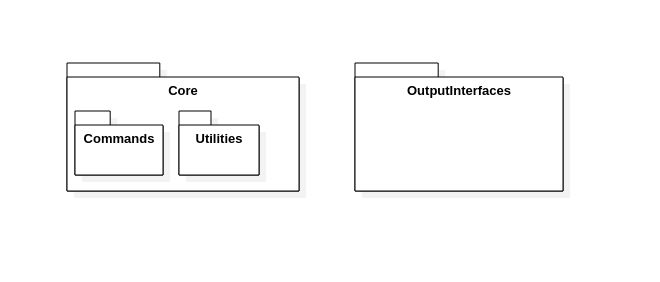

# NumberTranslator  
## What does NumberTranslator do?
This project generates an executable file called *word_convert* which is able to read a file, separate in sentences that file taking the period character as sentence end, and replace every number from one to one billion (one billion included) in words and translate it to a numerical one.
## How to install
Ensure that you have a working and configured CMake and you are connected to the Internet.
Clone this repository.  
Open a terminal, or terminal like, and go to the numberTranslator folder which is at the level of the LICENSE file.  
Once there:  
$ mkdir build  
$ cd build  
$ cmake ..  
$ cmake --build .   
## How to use
After the installataion in the directory you are (build) a *word_convert* executable can be found.  
Copy *word_convert* to your preferred location.
Add *.* separated plain texts to that location.
Open a terminal in that location.
Once there type ./word_converter -i *input_filename*
If the file doesn't exist you will be informed.
If the file exists you will get a sentence by sentence output of that file by terminal. In those sentences wordlike numbers will be converted to numerical ones.  
You can also type ./word_converter -i *input_filename* -o *output_filename*  
If you do so, the program will behave as before and it will also save the displayed sentences in *output_filename* which will be generated in the same directory as *word_convert* is located.
     

## Dependencies  
GTest has bee used for testing purposes. It is automatically downloaded the needed version once the project is build. It is widely used and powerful tool which enables Unit testing and more kind of testings.  
  
In order to generate *word_convert*, the executable code of NumberTranslator project, no ThirdParty software has been used.  
  
## Architectural overview  
### Package Diagram

### Packages  
  * Core: It is where the logic is in. Translator works in whole file/text level. Sentence_translator works with sentences as word strings.
    * Utilities: A library of standard functions that may be useful for this project. Stateless operations may be here.
    * Commands: Minor translation operations. For example units.
  * OutputInterfaces: Final destination of the informatiion.
  
### Development idea
Using TDD for the Core, after refactors the architecture emerges. The refactoring cicles are not completed. 

### Patterns
To represent information *OutputInterfaces* a simplified version of the **Observer** patern has been used. The translated information is sent to the **Subject** and the diferent interfaces (console and file output in this case) present that information.This makes easy to add another interface.  This kind of architecture may remember to **MVC**.
To split and make the amount of code easier to manage a **Command** pattern variation has been used. Thanks to this approach the code is more flexible to be addapted in the future, maybe with a factory but it also allows to refactor *Sentence_translator* more easily with an **State** pattern, for example.

## How does the program work?  
1- It reads the input file if posible, if not it returns an error.  
2- It split the file into sentences.
3- Those sentences are splited in words.  
4- The words of a sentence are analized one by one.   
5- If a word is composable with the previous one the program composes a numerical number.
6- Once a word cannot be composite with the previous ones, the composed number appears instead of the words of that number.
7- When the sentence is finishes, the numeric composition buffer is checked.
8- After processing every sentence they are merged.
9- That merged text is collected by a subject. This subject will at least has subscribed an observer which will output the text by console. I -o parameter has been used it will also subscribe a file generator.
10- The text will be displayed in the console.
11- If the -o parameter has been used a new file will be generated at the same level the executable is. It will be named as the string after -o.

## Run tests
At the time *word_convert* is generated, the project also generates *NumberTranslatorTestCore*. Run this executable to run the tests.